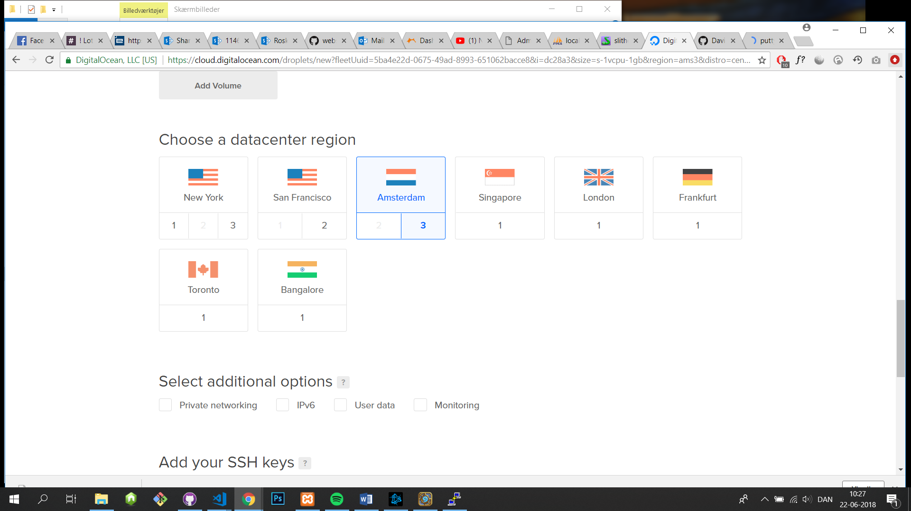
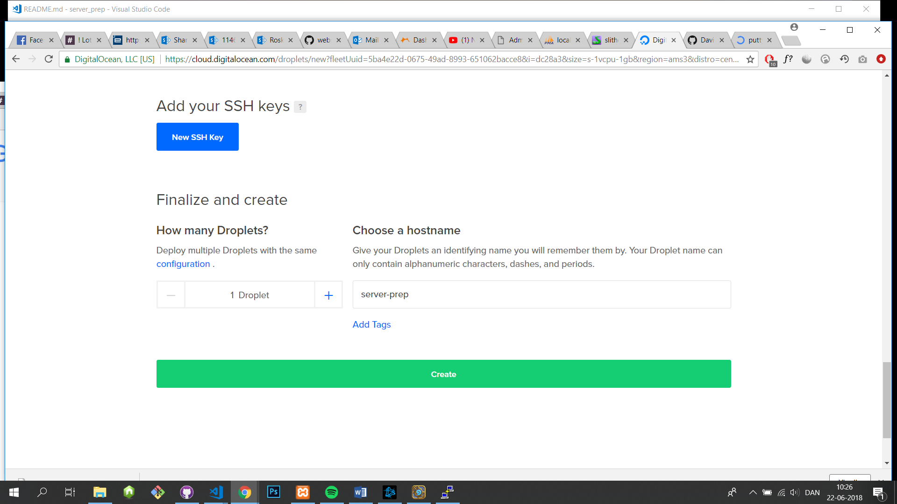
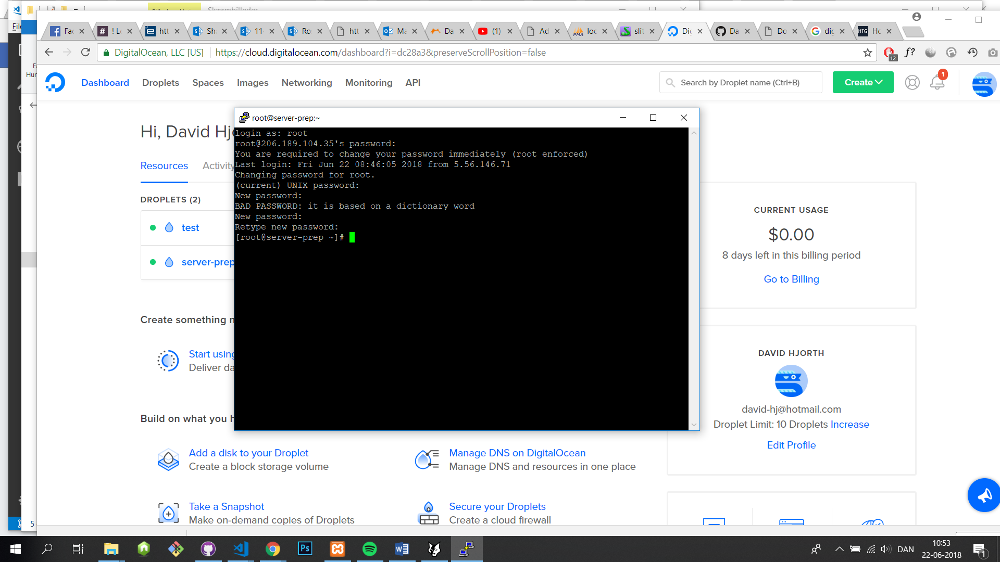
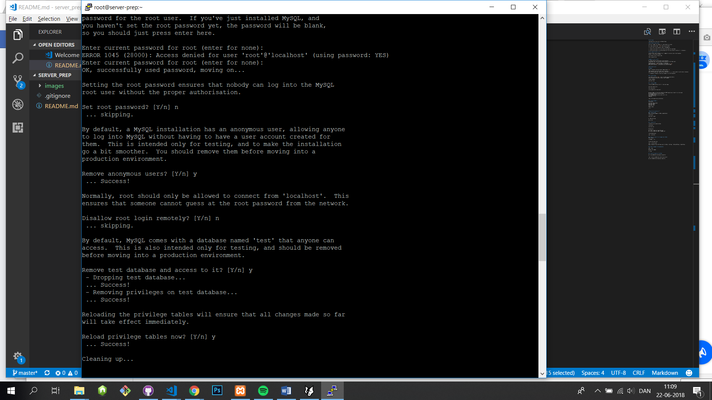

# server_prep

sådan opsættes en linus server via Digital Ocean


# Opret Digital Ocean droplet

efter du er logget ind, navigere til create droplets via create.

her vælges system billeder CentOS med version 6,9 32bit.

størelse på den virtuelle maskine vælges til 1GB 20GB ssd .

så vælges en server gerne tæt på din location som london eller amsterdam.

til sidst skal der gives et fornuftigt og gerne kort host navn.


lave en droplet CentOS ver 6,9 32 bit


vælg billigst løsning for virtuel maskin kraft + størrelse ( 1gb 20gb ssd)

tag en server tæt på dig selv (amsterdam / london)

vælg et host name (helst ikke for langt da det sstår i terminalen ved hver kommando linje)



-----


brug de tilsendte informationer til at connecte med den virtuelle maskine via putty som skal hentes fra internettet.
Download denne fra: http://www.putty.org/   


via tilsendt ip addresses oprettes forbindelse (gem evt som preset så der ikke skal indsætted ip ved opstart)

i terminalen logges der inde med Root som brugernavn og tilsendt PW som skal ændres ved første login.

herefter følges nedunderstående guide....

husk: cd = change directory , lms se fil struktur og cat kan bruges istedet for nano


-----


# Linux-server med Node.js & MySQL

## 0. Installer Nano
Nano er en linux tekst editor, som er rigtig let at bruge.

Installation
```
yum install nano
```

## 1. Installer MySQL
Installation
```
yum install mysql-server
```

se billed for svar på installations spørgsmål
Start/stop/restart
```
service mysqld start/stop/restart
```

Konfigurer MySQL
```
sudo /usr/bin/mysql_secure_installation
```

## 2. Installer Node.js
 ||yum install epel-release|| tryk ||y||
 ||yum install nodejs||
 ||yum install npm|| tryk ||y|| tryk ||y||
 ||sudo npm config set strict-ssl false||
 ||yum install -g n||
 ||n lts||
 ||n||
 på digital ocean tryk på 'on' knap, for at slukke den. tænd igen (genstart)

Luk din puTTy og åben den igen

**Genstart din linux-box nu.**

## 3. Installer PM2
PM2 er en process manager til Node.js applikationer.

Installation
```
npm install -g pm2
```

Kør PM2 ved startup
```
pm2 startup
```

## 4. Installer Git
Installation
```
yum install git
```

Konfiguration
```
git config --global user.name "Dit navn"
git config --global user.email "din@email.dk"
```

Tjek konfigurationen
```
nano ~/.gitconfig eller cat ~/
```

## 5. Opret et nøglesæt til at logge ind på GitHub
Opret nøglesæt
```
ssh-keygen -t rsa
```

Åbn den offentlige nøgle
```
nano ~/.ssh/id_rsa.pub
(shift x for at forlade)

Kopier indholdet af den offentlige nøgle til GitHub -> Settings -> SSH and GPG keys -> New SSH key
```

## 6. Opret en mappe til din applikation
```
mkdir ~/www
```
Naviger ind i mappen
```
cd ~/www
```

## 7. Klon dit repository fra GitHub
```
git clone git@github.com:brugernavn/repository
```

(og når du har en opdatering, skal du lave et pull)
```
git pull git@github.com:brugernavn/repository'

```


hvis det er forked så skal der stå master efter repository.

npm install efter cloning fra git. 


-------
sætter pm 2 settings op

```
pm2 startup

```

pm2 start app/app.js


```
 pm2 start app(.js)
 
```
for at få pm til ikke at slukke efter putty stoppes

```
$ pm2 save
$ pm2 freeze
 
```


man kan også lave alias for hurtiger pull fx:

```
  alias pull="git pull git@github.com:David-jrh/expressjs master"
  
```

for at se en færdig side skrive ip + : valgte port :

```

http://188.166.150.132:3000/
```
